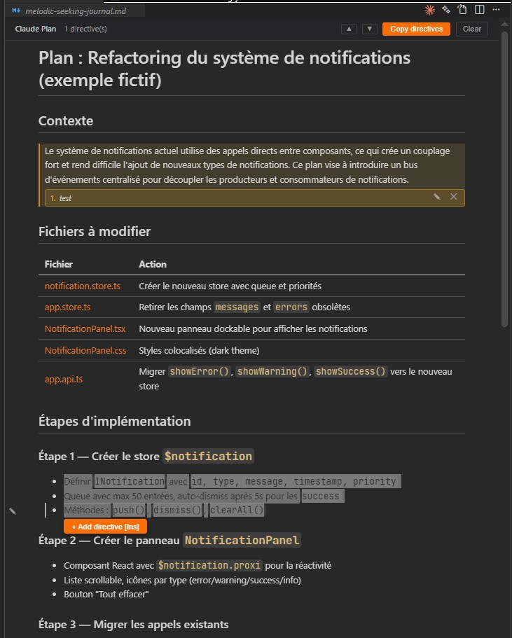

# Claude Plan — Annotate & Review AI Plans

**Annotate markdown plans directly in VS Code's preview mode, then send your feedback to Claude Code in one click.**

Claude Plan bridges the gap between reading an AI-generated plan and giving structured feedback. Instead of typing long instructions, simply select the parts you want changed, add directives, and send everything to Claude Code — preserving your conversation context.



## Features

### Inline Directives in Markdown Preview
Select text or hover any line in the markdown preview to add directives. Each directive is displayed as a numbered badge directly on the plan.

### Gutter Pencil
Hover over any line to reveal a pencil icon (✎) on the left. Click it to instantly add a directive for the entire line — no text selection needed.

### One-Click Send to Claude Code
Click the ✨ button in the editor title bar or press `Alt+Enter` to paste your directives directly into the Claude Code chat input. Your conversation context is preserved.

### Smart Targeting
Directives target the exact element you selected — even inside tables, lists, and nested structures. No more annotations spilling across an entire section.

### Structured Prompt Format
Directives are formatted for maximum clarity:
```
fix:plan (plan.md)
1. "Migrate to the new database schema" (~line 8): Add a data migration step before refactoring
2. "Write integration tests" (~line 12): Prioritize non-regression tests on critical endpoints
```

## Usage

### In Markdown Preview (recommended)

1. Open a markdown file and switch to **preview mode** (`Ctrl+Shift+V`)
2. **Select text** → a floating "Add directive" button appears, or press `Insert`
3. **Hover a line** → click the ✎ pencil icon for a quick whole-line directive
4. Type your directive and press `Enter`
5. Repeat for all sections you want to change
6. Click **✨** in the title bar or press `Alt+Enter` → directives are pasted into Claude Code

### In Source Editor

1. Select text in a `.md` file
2. Right-click → **Claude Plan: Add Directive**, or press `Insert`
3. Click **✨** or press `Alt+Enter` to send

## Keyboard Shortcuts

| Shortcut | Action |
|----------|--------|
| `Insert` | Add directive on current selection or hovered line |
| `Alt+Enter` | Send all directives to Claude Code |

## Commands

| Command | Description |
|---------|-------------|
| `Claude Plan: Add Directive` | Add a directive to the selected text |
| `Claude Plan: Send to Claude Code` | Send all directives to Claude Code chat |
| `Claude Plan: Clear All Directives` | Remove all directives |
| `Claude Plan: Show Info` | Show directive count and status |

## Requirements

- **VS Code** 1.85.0 or later
- **Claude Code extension** (`anthropic.claude-code`) — for the one-click send feature
- **Windows** — the auto-paste feature uses PowerShell SendKeys (clipboard fallback on other platforms)

## How It Works

Claude Plan injects a lightweight script into VS Code's built-in markdown preview. This script handles:

- Text selection detection and floating button display
- Gutter pencil hover indicators
- Inline directive badges with edit/delete controls
- Clipboard synchronization for the send-to-Claude feature

The extension itself manages the ✨ title bar button, keyboard shortcuts, and the communication bridge to Claude Code via focus + simulated paste.

## Known Limitations

- Line numbers in directives are approximate (`~line`) due to markdown preview rendering. The selected text excerpt is always included for precise identification.
- The auto-paste feature requires Windows (PowerShell). On macOS/Linux, directives are copied to clipboard instead.
- Directives persist while switching tabs but are cleared when the preview is closed.

## License

MIT — see [LICENSE](LICENSE)
